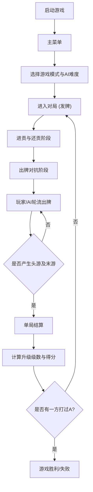

## 1. 产品概述
单机版扑克牌“掼蛋”游戏合集。
- 采用两副扑克牌（共108张），2人对2人组队对抗，核心还原进贡、还贡、牌型大小比拼和升级规则。
- 目标受众为喜欢掼蛋或想练习掼蛋的玩家，提供不同难度的AI对战、精美的界面UI以及智能出牌提示功能。

## 2. 核心功能

### 2.1 用户角色
| 角色 | 注册方式 | 核心权限 |
|------|----------|----------|
| 玩家 | 无需注册 | 体验所有单机游戏模式，调整设置，保存游戏进度 |

### 2.2 功能模块
1. **主菜单**：开始游戏（单局模式/闯关模式）、新手教程、设置、退出。
2. **游戏对局界面**：包含顶部状态栏、左侧AI玩家区、中间出牌区、右侧己方手牌区、底部功能区。
3. **设置面板**：背景/牌面样式切换、音效开关、AI难度调节。

### 2.3 页面详情
| 页面名称 | 模块名称 | 功能描述 |
|----------|----------|----------|
| 主菜单 | 导航区 | 提供进入各个游戏模式和设置的入口 |
| 游戏对局 | 状态栏 | 显示当前级别、剩余牌数、双方得分、游戏时长 |
| 游戏对局 | AI玩家区 | 显示AI头像、剩余手牌数、最近出牌记录 |
| 游戏对局 | 出牌区 | 居中展示当前轮次所有玩家出牌，附带牌型特效（如氢弹爆炸） |
| 游戏对局 | 手牌区 | 展示玩家手牌，支持拖拽排序、点击选牌、自动/手动排序切换 |
| 游戏对局 | 功能操作 | 出牌、不出（过牌）、提示、暂停菜单 |
| 教程页面 | 新手引导 | 分步图文/动画讲解规则、牌型、出牌技巧 |

## 3. 核心流程
玩家启动游戏 -> 选择游戏模式（单局/闯关）-> 设置AI难度 -> 进入对局 -> 发牌与进贡/还贡 -> 轮流出牌对抗 -> 单局结算（判断头游、末游）-> 升级与得分计算 -> 游戏结束或继续下一局。

## 4. 用户界面设计
### 4.1 设计风格
- **主色调**：藏蓝 + 浅金（凸显复古与高级质感），背景为浅色系渐变（米白+浅灰），避免视觉疲劳。
- **按钮样式**：圆角设计，扁平化带轻微阴影，悬停时有高亮反馈。
- **字体**：醒目且优雅的无衬线字体，扑克牌面采用经典复古点数与花色字体。
- **卡牌风格**：经典复古，花色区分明显，大小王带有专属“王者”标识。
- **动效**：卡牌悬停放大，出牌平滑过渡，特殊牌型（氢弹、火箭）带有炫酷爆炸特效。

### 4.2 页面设计概览
| 页面名称 | 模块名称 | UI元素设计 |
|----------|----------|------------|
| 游戏对局 | 顶部状态 | 半透明背景面板，清晰的文字排版显示级别与时长 |
| 游戏对局 | 扑克牌面 | 圆角矩形，高对比度花色，手牌支持选中上浮状态 |
| 游戏对局 | 出牌区 | 卡牌适当缩小，层叠显示，带有玩家标识和出牌类型标签 |
| 设置弹窗 | 控制面板 | 居中模态框，包含滑块（音量）、下拉菜单（难度）、开关选项 |

### 4.3 响应式要求
- **优先适配桌面端**：推荐 1920x1080，自适应缩放至 1280x720 及以上分辨率。
- 支持全屏与窗口化自由切换。
- 不强制要求移动端适配（定位为单机版电脑游戏），但需保证在不同宽高比的桌面显示器上布局不乱。

### 4.4 音效设计
- 交互音效：发牌声、选牌声、出牌声、错误提示音。
- 特效音效：火箭升空、氢弹爆炸、胜利/失败专属背景音、进贡提示音。
- 背景音乐：轻松舒缓的棋牌室风格音乐，可随时静音。
