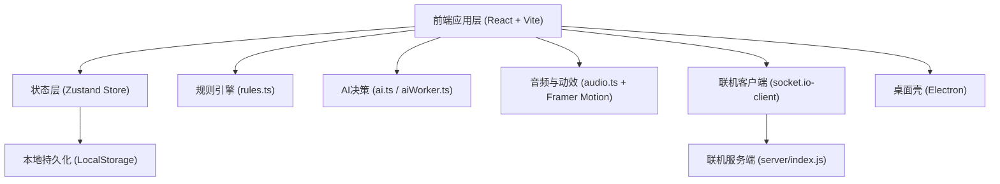

## 1. 架构总览（当前）



## 2. 技术栈与职责

- 前端框架: `React 18 + TypeScript + Vite`
- 状态管理: `Zustand`，承载对局状态机、回合推进、结算、设置
- 样式与动效: `Tailwind CSS + Framer Motion`
- 规则层: `rules.ts` 负责牌型识别与可压判断
- AI层: `ai.ts` 启发式策略，`aiWorker.ts` 负责异步计算，避免阻塞主线程
- 联机层: `Socket.IO`，目前为房间广播模型，已加入服务端出牌合法性校验
- 持久化: `LocalStorage`（设置、玩家统计、最近对局快照）
- 桌面打包: `Electron + electron-builder`

## 3. 场景路由策略

项目当前不使用 React Router，采用全局 `status` 状态切场景：

- `menu`: 主菜单
- `lobby`: 联机大厅
- `grouping`: 摸牌定庄/分组
- `dealing`: 发牌动画
- `tribute`: 进贡/还贡
- `playing`: 对局中
- `settlement`: 结算页

优势是状态集中、逻辑清晰；后续若引入 Router，建议只做“外层壳路由”，内部仍用状态机驱动。

## 4. 核心数据模型（简化）

```typescript
type PlayerId = 'p1' | 'p2' | 'p3' | 'p4';
type Team = 'teamA' | 'teamB';

interface Card {
  id: string;
  suit: 'spade' | 'heart' | 'club' | 'diamond' | 'joker';
  rank: 2 | 3 | 4 | 5 | 6 | 7 | 8 | 9 | 10 | 'J' | 'Q' | 'K' | 'A' | 'Small' | 'Big';
  value: number;
  isLevelCard: boolean;
  isRedJoker?: boolean;
}

enum PlayType {
  Single = 'Single',
  Pair = 'Pair',
  Triple = 'Triple',
  TripleWithPair = 'TripleWithPair',
  Straight = 'Straight',
  Tube = 'Tube',
  Plate = 'Plate',
  StraightFlush = 'StraightFlush',
  Bomb = 'Bomb',
  Rocket = 'Rocket',
  Pass = 'Pass',
}
```

## 5. AI 设计（当前与目标）

### 当前实现

- 易/中/难共享一套启发式决策框架
- 通过 `generateAllPlays` + `canPlay` 生成候选并排序
- 策略重点：
  - 不拆牌优先、炸弹保留
  - 队友让牌与残局拦截
  - 首发优先走复杂牌型，减少手数

### 目标演进

- 引入更强的对手建模与风险评估（但保持实时性能）
- 难度分层从“参数差异”升级到“策略组合差异”
- 保持 Worker 异步，不牺牲 UI 流畅度

## 6. 联机一致性策略（现状）

- 服务端维护房间状态快照
- 客户端出牌前本地先验规则检查
- 服务端再次校验：
  - 是否轮到该玩家
  - 牌是否属于该玩家当前手牌
  - 是否满足 `canPlay` 与牌型规则
- 校验通过后服务端广播权威状态；失败返回错误事件给发起端

## 7. 推进路线（执行优先级）

1. 文档与代码基线一致化（已完成）
2. Store 状态更新不可变改造（避免隐式副作用）
3. 对局关键状态持久化与恢复
4. 联机从广播模型向权威状态机渐进迁移
5. AI 异步化与策略增强并行推进
